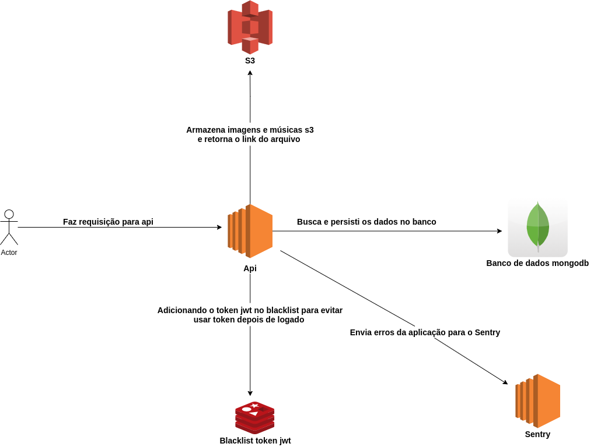
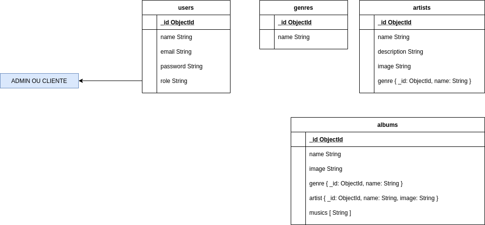

Requirements:
===============

- Node.js
- Npm
- Typescript
- Docker
- Docker compose

Technologies:
==============
- Node.js
- Npm
- Typescript
- Docker
- Docker compose
- Mongodb
- Redis
- Sentry
- Jest

Architecture:
==============

 Explain image about architecture above:
    - Client make request api
    - Api persist and query data in mongodb. I'm used mongodb her perfomance and flexibily.
    - When perist image I'm used S3 this solution prevent problem with disk full the machine, availability and this strategy allow scale this api horizontally
    - When user make logout add token jwt in redis(blacklist) in this case I'm used this solution prevent token jwt be used after logout same jwt token no expired
    - When occour internal server error I'm used Sentry(service monitoring errors in application) where send error to Sentry and this service notify dev team per email.

Database diagram:
===================

Setting dev environment:
==========================

- Clone project
- Execute command: **npm install** this command is used to install modules used in application
- Create **.env** file based in **.env.example** file
- Execute command: **docker-compose up -d** used to create mongodb(database) and redis(blacklist)
- Execute command: **npm run start:dev** to create server http.

Setting test environment:
==========================

- Clone project
- Execute command: **npm install** this command is used to install modules used in application
- Create **.env.testing** file based in **.env.example** file
- Execute command: **docker-compose -f docker-compose.dev.yml up -d** used to create mongodb(database) and redis(blacklist)
- Execute command: **npm run test** to execute unit and integration tests.

Details necessary to test api:
==============================

- Import **postman_collection.json** file in postman when import this file in postman is load routes and body data the requests
- Import **PROD.postman_environment.json** file in postman this file is environment variable the production
- Import **Dev.postman_environment.json** file in postman this file is environment variable the development

- OBSERVATION: after make instruction above you need access collection in part authentication to create and after authenticate. After authenticate get token jwt and add in environment to prevent add all requests.